# Flourish

Flourish is an Android application designed to support personal wellbeing through habit tracking, mood journaling, and sleep monitoring.

The app features a virtual plant that grows or withers based on the user's daily actions, creating a visual and emotional connection between healthy habits and personal progress.

## Features
- 🌱 **Virtual Plant System** – A plant that grows or withers depending on the user's healthy habits.
- 💧 **Habit Tracking** – Positive activities such as meditation, breathing exercises, or physical activity generate "water drops" used to maintain the plant's health.
- 📅 **Weekly Activity Calendar** – Users can register completed activities and monitor their weekly consistency.
- 😴 **Sleep Tracking** – Daily sleep quality tracking.
- 😊 **Mood Journal** – Users can record their mood multiple times a day using expressive icons.
- 📊 **Statistics Dashboard** – Interactive charts showing the distribution of completed activities and trends in mood and sleep over time.
- 🧘 **Mindfulness Section** – Guided breathing exercises to support relaxation and focus.

## Tech Stack
- **Kotlin** – main programming language for the application logic
- **Jetpack Compose** – declarative UI toolkit used to build the entire interface
- **Room** – local database used for storing user activities, mood, and sleep data
- **DataStore** – used for managing user preferences
- **Koin** – dependency injection framework
- **MPAndroidChart** – library used to visualize mood and sleep trends
- **Lottie** – used to integrate lightweight animations into the UI

## Architecture
The application follows the **MVVM (Model–View–ViewModel)** architecture pattern to ensure a clear separation between UI, business logic, and data management.

- **View**: Built using Jetpack Compose components.
- **ViewModel**: Manages UI state and business logic.
- **Model**: Handles data persistence using Room and DataStore.

Dependency Injection is implemented using **Koin**, enabling a modular and maintainable architecture.

## Screenshots

### Authentication
User authentication screens allowing secure access to the application.

| 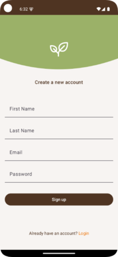 | 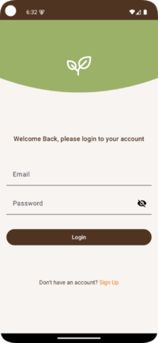 |
|:-----------------------------------------------:|:---------------------------------------------:|

### Weekly Activity Calendar
Screens related to the weekly calendar where users can register completed activities.

| 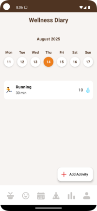 | 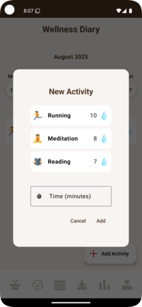 |
|:-------------------------------------------:|:------------------------------------------------------:|

### Wellbeing Tracking
Screens for monitoring personal wellbeing, including sleep tracking, mood journaling, statistics, and user profile.

| 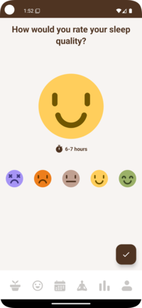 | 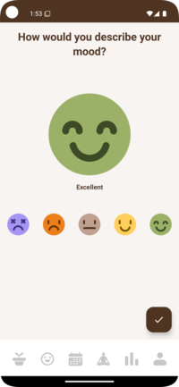 | 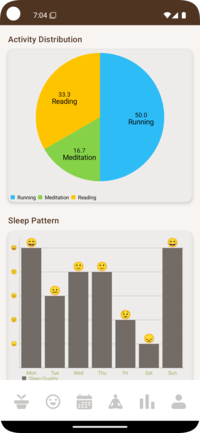 | 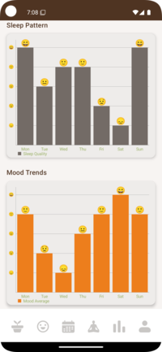 |  |
|:------------------------------------------:|:----------------------------------------:|:-------------------------------------------------------:|:------------------------------------------------:|:---------------------------------------:|

### Guided Breathing Exercises
Screens related to the mindfulness section with guided breathing exercises.

|  |  |  | 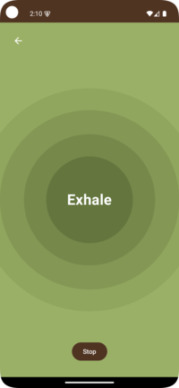 |
|:-------------------------------------------------------:|:-----------------------------------------------------:|:--------------------------------------------------:|:---------------------------------------------------:|

### Virtual Plant Growth Stages
Different growth stages of the virtual plant depending on the user's wellbeing progress.

| 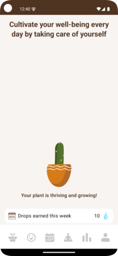 | 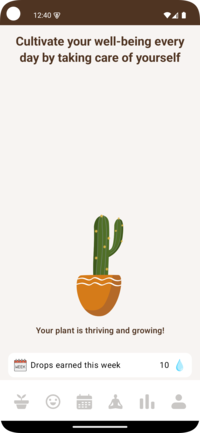 | 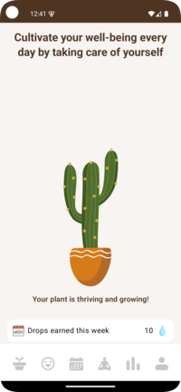 | 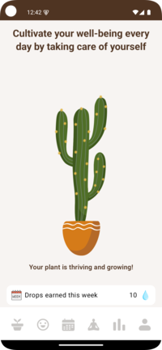 | 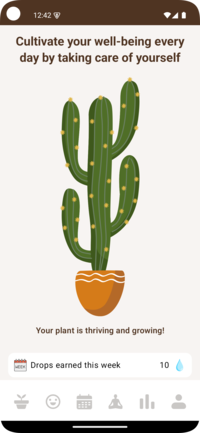 |
|:------------------------------------------------------:|:------------------------------------------------------:|:------------------------------------------------------:|:------------------------------------------------------:|:------------------------------------------------------:|

## Author
[Simone Ruggeri](github.com/simone-ruggeri)
